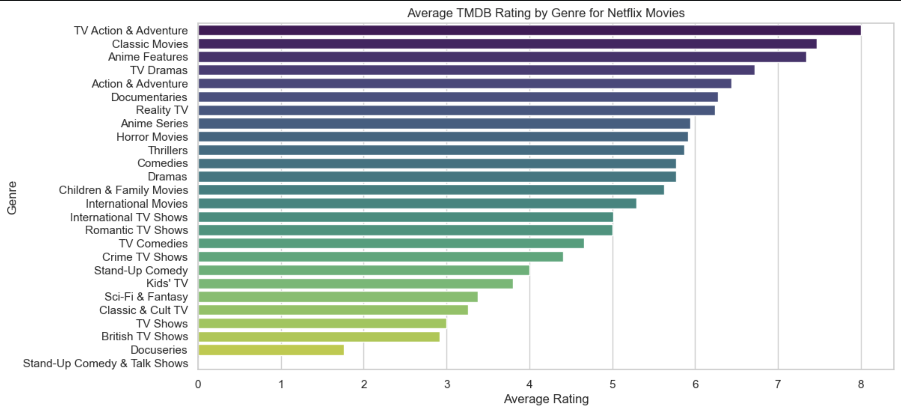
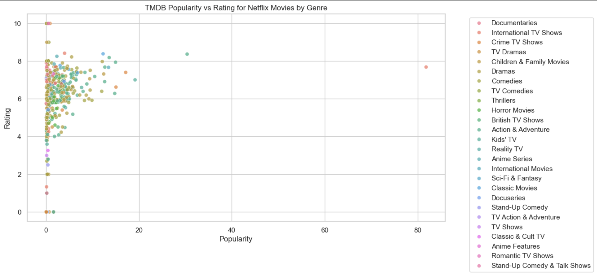

# 🎬 Netflix Data Wrangling & TMDb Analysis

## Overview

This project demonstrates an end-to-end data wrangling workflow using two real-world datasets. Netflix title data was combined with metadata retrieved from The Movie Database (TMDb) API to create a cleaner, more complete dataset for analysis.

The project follows the complete data wrangling process: gathering, assessing, cleaning, storing, and analyzing data to answer a research question about movie genres, ratings, and popularity.

---

## Research Question

**Which movie genres on Netflix tend to have higher TMDb ratings, and how does popularity relate to these ratings?**

---

## Data Sources

### Dataset 1 – Netflix Titles

* **Source:** Kaggle
* **Format:** CSV
* **Contents:** Netflix movies and TV shows, including title, release year, country, genres, and ratings.

### Dataset 2 – TMDb API

* **Source:** The Movie Database (TMDb)
* **Method:** REST API
* **Contents:** Movie popularity, average ratings, release information, and additional metadata.

---

## Tools & Technologies

* Python
* Pandas
* NumPy
* Requests
* Jupyter Notebook
* TMDb API

---

## Project Workflow

### 1. Data Collection

* Downloaded Netflix titles dataset from Kaggle.
* Retrieved additional movie information using the TMDb API.
* Combined both datasets for further analysis.

### 2. Data Assessment

Identified data quality and tidiness issues, including:

* Missing values
* Inconsistent formatting
* Multiple genres stored in a single column
* Data type inconsistencies

### 3. Data Cleaning

Performed several cleaning steps to improve data quality:

* Handled missing values
* Standardized text formatting
* Split multiple genres into individual records
* Converted appropriate columns to categorical data types
* Removed unnecessary variables
* Merged datasets into a single analytical dataset

### 4. Data Storage

Saved the cleaned dataset for future analysis and reproducibility.

### 5. Analysis

Explored the relationship between:

* Movie genres
* TMDb user ratings
* Popularity scores

to answer the project's research question.

---

## Key Findings

* Classic movies achieved some of the highest average TMDb ratings.
* Highly rated movies were not always the most popular.
* Many Netflix titles with ratings between **6 and 8** had relatively low popularity, suggesting that audience ratings and popularity do not necessarily move together.
* Combining Netflix and TMDb data provided richer insights than either dataset alone.

---


## Sample Output





---


## Skills Demonstrated

* Data Gathering
* API Integration
* Data Wrangling
* Data Cleaning
* Data Assessment
* Data Merging
* Exploratory Data Analysis
* Feature Transformation
* Python Programming

---

## Repository Structure

```text
.
├── Data_Wrangling_Project.ipynb
├── cleaned_data.csv
├── README.md
```

---

## How to Run

1. Clone the repository.

```bash
git clone https://github.com/GhadeerMMQ/<repository-name>.git
```

2. Install the required packages.

```bash
pip install pandas numpy requests jupyter
```

3. Obtain a TMDb API key and configure it in your `config.ini` file.

4. Open the notebook and run all cells.

---

## What I Learned

This project strengthened my understanding of real-world data wrangling by working with multiple data sources, integrating external APIs, identifying data quality issues, and preparing a reliable dataset for analysis. It also reinforced best practices for building reproducible data pipelines in Python.

---

## Author

**Ghadeer Almuqbil**

Physics graduate transitioning into Data Analytics with an interest in data wrangling, SQL, Python, and transforming raw data into actionable insights.
